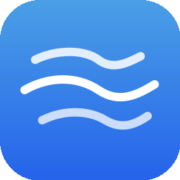

<p align="center">
  
</p>

# Zephyr

A minimalistic ESV Bible reader for macOS.

Zephyr is a native Mac app built with SwiftUI that puts Scripture front and center — no accounts, no ads, no distractions. Just the Word.

<table align="center">
  <tr><td align="center">
    <br>
    <em>Clean, distraction-free reading</em>
  </td></tr>
  <tr><td align="center">
    <br>
    <em>Scrubber for quick navigation through all 66 books</em>
  </td></tr>
  <tr><td align="center">
    <br>
    <em>Search for any verse directly from Spotlight</em>
  </td></tr>
</table>

## Why Zephyr?

Most Bible apps try to do everything — social features, devotional plans, video content, push notifications. I just wanted to read Scripture. No clutter, no accounts, no internet required.

I couldn't find a native macOS Bible reader that felt like it belonged on the Mac — lightweight, fast, and focused. So I built one. Zephyr is the app I wanted for my own daily reading: open it, read, close it. Nothing else getting in the way.

The name comes from the Greek word for a gentle breeze — that's exactly how reading Scripture should feel.

Zephyr will always be free. If you find it useful, consider [sponsoring the project on GitHub](https://github.com/sponsors/jonyen).

## Download

**[Download Zephyr v0.8.9](https://github.com/jonyen/zephyr/releases/download/v0.8.9/Zephyr-0.8.9.dmg)** (macOS 14+)

Open the DMG and drag Zephyr to your Applications folder.

## Features

- **Full ESV Bible** — All 66 books, offline and instantly accessible
- **Reading Themes** — System, Light, Dark, Sepia, and Black themes for any lighting condition
- **Font Selection** — Choose from Georgia, Palatino, or Helvetica Neue
- **Bionic Reading** — Bold-leading-letters reading mode to improve reading speed
- **Spotlight Integration** — Search for any verse or passage directly from macOS Spotlight
- **Bookmarks** — Save your place and quickly return to passages
- **Highlights** — Mark verses with color highlights as you read
- **Private Notes** — Add personal notes to any verse range, stored locally on your device
- **Bible Scrubber** — Scan through the Bible with a scrubber that feels like flipping through a physical book
- **Keyword Search** — Full-text search across the entire Bible
- **Red Letter** — Words of Christ displayed in red
- **Tabbed Browsing** — Open multiple passages in separate tabs
- **Reading History** — Automatically tracks where you've been
- **Auto-Update** — Get notified when a new version is available
- **Completely Free** — No ads, no in-app purchases, no accounts, no tracking

## Building from Source

Requires Xcode 16+ and macOS 14+.

```bash
# Clone the repository
git clone https://github.com/jonyen/zephyr.git
cd zephyr

# Build and create DMG
./Scripts/build-dmg.sh
```

The DMG will be created in the `dist/` directory.

## License

All Scripture quotations are from the ESV (English Standard Version) Bible.
